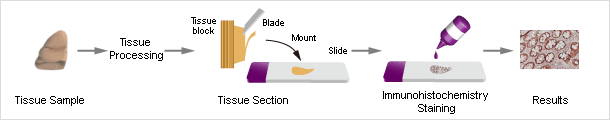

```{r setup, include=FALSE}
knitr::opts_chunk$set(echo = FALSE)
#knitr::opts_chunk$set(eval = FALSE)
#library(mgcv)
#library(plotly)
```


# Motivating Problem

## Immunohistochemistry (IHC) Biomarkers

```{r, out.width = "850px"}

```

- Immunofluorescence IHC (IF-IHC): antibody binding to antigen in tissues, visualized using fluorophore

- Traditionally, pathologists subjectively evaluate IHC marker levels based on staining intensity, in ordinal (e.g. low, medium and high) or nominal (positive/negative) scales.

- [Quantitative IF-IHC]{style="color:red;font-weight:bold;"} (2000's): measure proteins in region of interest of individual cancer cells (e.g. nuclei, cytoplasm or membranes) and compute [mean-signal-intensity (MSI)]{style="color:red;font-weight:bold;"} from [cellular signal intensity (CSI)]{style="color:green;font-weight:bold;"}

- For homogeneously expressed proteins, MSI is highly consistent between different automated quantitative IHC image-analysis platforms. More powerful and specialized alternatives to MSI are needed for proteins that are heterogeneously expressed in the tumor or stroma.

## Tissue Microarrays (TMA) for IHC biomarkers

```{r eval = TRUE, out.width = "800px"}

```

## Invasive Breast Cancer TMA Data

- 1893 patients; tissue specimens from 1988-2012, up to 240-month follow-up

- Progression-free (PFS), overall survival (OS)

- QIF-IHC images on 100+ selected therapy-relevant target proteins.  Biomarker levels were not affected by neoadjuvant drugs or radiation, as no patients received anti-cancer treatment prior to surgery

- [pYStat5]{style="color:magenta;font-weight:bold;"} is a latent cytoplasmic transcription factor and a primary mediator of prolactin signaling in breast epithelia.  Loss of pYStat5 is a known risk factor for poor clinical outcome (@Peck11)

- [pYStat5]{style="color:magenta;font-weight:bold;"}, [cytokeratin]{style="color:green;font-weight:bold;"}, and [DAPI]{style="color:blue;font-weight:bold;"}

```{r eval = TRUE, out.width = "750px"}

```

## Sample distributions of CSI levels

- *Mean signal intensity (MSI)* is computed within the region
of interest

- However, same MSI levels may correspond to different cellular signal intensity (CSI) distributions

```{r eval = TRUE, out.width = "700px"}

```

		
# Qindex: The R Package

## Pre-Processing

```{r echo = TRUE, eval = TRUE}
library(spatstat.grouped)
data(Ki67, package = 'spatstat.grouped.data')
Ki67 = within.data.frame(Ki67, expr = {
  Ki67 = log1p(Ki67)
  PFS = survival::Surv(time = recfreesurv_mon, event = recurrence); recfreesurv_mon = recurrence = NULL
})
```

## Cluster-Specific Sample Quantiles

```{r echo = TRUE, eval = TRUE}
Ki67q = grouped_ppp(Ki67 ~ PFS + node + Tstage | patientID/tissueID, data = Ki67) |>
  aggregate_quantile(by = ~ patientID, probs = seq.int(from = .01, to = .99, by = .01))

head(Ki67q$Ki67.quantile, n = c(4L, 6L))
```

- Pipeline `grouped_ppp |> aggregate_quantile` {style="color:magenta;font-weight:bold;"}

- Collapse/aggregate the distribution of `Ki67`{style="color:blue;font-weight:bold;"} into quantile indices, by `tissueID` nested in `patientID`{style="color:green;font-weight:bold;"}

- All other predictors are retained

- Returned `Ki67q$Ki67.quantile`{style="color:red;font-weight:bold;"}: matrix of cluster-specific sample quantiles $\mathbf{q}=(q_1,\cdots,q_N)$ of `Ki67`{style="color:blue;font-weight:bold;"}


## Functional Regression Indices, [Linear]{style="color:green;"} & [Nonlinear]{style="color:blue;"}

- Empirical quantile function [$Q_k(p)$]{style="color:red;font-weight:bold;"} for $k$-th patient

- Proportional hazard functional regression model for survival response (@James02)

- Linear functional Cox model (LFCM), @Gellar15
$$\log h_k(t)=\log h_0(t)+ \color{green}{\int_0^1 \beta(p)\ Q_k(p)dp}$$

- Additive functional Cox model (AFCM), @Cui21
$$\log h_k(t) = \log h_0(t)+ \color{blue}{\int_0^1 F\big(p, Q_k(p)\big)dp}$$

- <font size="3">Functional coefficient function [$\beta(p)$]{style="color:green;font-weight:bold;"}: a spline; or a piece-wise linear function</font>

- <font size="3">Bivariate twice differentiable function [$F(\cdot,\cdot)$]{style="color:blue;font-weight:bold;"}: a tensor product of univariate $P$-splines (@McLean14) $F(s,x)=\sum^{N_s}_{i=1} \sum^{N_x}_{l=1} \theta_{i,l}\ B_i(s)\ B_l(x)$, where $B_i$ and $B_l$ are univariate splines on the domains of $s$ and $x$, respectively.</font>


## Functional Regression Indices

```{r echo = TRUE, results = 'hide'}
npt = length(unique(Ki67$patientID)) # 622
set.seed(234); id = sort.int(sample.int(n = npt, size = 500L))
Ki67q_0 = Ki67q[id, , drop = FALSE] # training set
Ki67q_1 = Ki67q[-id, , drop = FALSE] # test set

(fr = Qindex(PFS ~ Ki67.quantile, data = Ki67q_0))
(nlfr = Qindex(PFS ~ Ki67.quantile, data = Ki67q_0, nonlinear = TRUE))
```

- Function `gam_matrix::FRidx`{style="color:magenta;font-weight:bold;"}

1. Fit a functional regression model (via `mgcv::gam`) to `PFS` using functional predictor `marker`;

2. Obtain the `sign` of the correlation between `marker[,j]` (the column at the median of tabulating grid) and  `gam(.)$linear.predictors`

3. Functional regression quantile indices are the product of sign (from Step 2) and `gam(.)$linear.predictors` (from Step 1). Multiplication by sign ensures that the functional regression indices are positively correlated with `marker[,j]`.


## Functional Regression Indices, Linear

```{r eval = TRUE, out.width = "950px"}

```

## Functional Regression Indices, Nonlinear

```{r echo = TRUE}
integrandSurface(nlfr, newdata = Ki67q_1, newid = 1:20)
```


## In External Validation Cohort

- 273 ER+ patients; 31 progression events (@Yi23a)

```{r eval = TRUE, out.width = "600px"}

```


## Acknowledgments

- Misung Yi$^1$, Ph.D. Dankook University, Republic of Korea

- Inna Chervoneva$^2$, Ph.D.  Amy R. Peck$^3$, Ph.D. Hallgeir Rui$^6$, M.D., Ph.D.  Thomas Jefferson University

- Yunguang Sun$^4$, Ph.D. Medical College of Wisconsin

- Brenton Maisel$^5$, M.D., Ph.D. University of California Irvine

- NIH/NCI R01 CA222847 (PI: Chervoneva) 
- NIH/NCI R01 CA267549 (MPIs: Rui, Chervoneva)

- @Yi23a

```{r, out.width = "950px"}

```

## References {.smaller .smaller}

